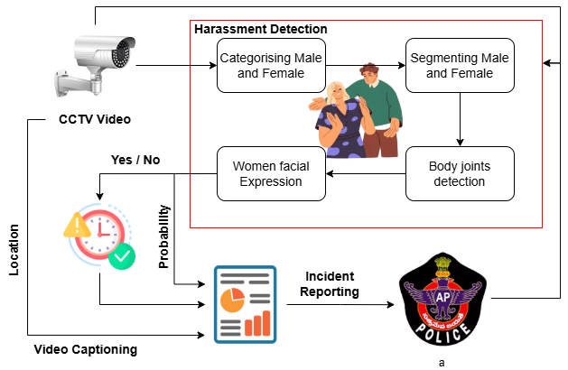

# Swetcha: Automated Harassment Detection for Women Safety

 

---
### Watch the demo video: 
[Watch Sample Video](output_videos/pred_true_1.mp4)

## 🔍 Overview
Swetcha is an **AI-powered real-time harassment detection system** designed to enhance women’s safety by leveraging **computer vision, deep learning, and video captioning**. The system seamlessly integrates with **CCTV surveillance networks** to detect suspicious behavior, classify human interactions, and generate real-time alerts to law enforcement.

This project is inspired by the growing need for **proactive public safety measures** and aims to bridge the gap between **traditional monitoring systems and AI-driven security solutions**.

## 🚀 Features
- **Real-time monitoring** of human interactions using **computer vision**.
- **Gender classification** and **behavior analysis** to detect suspicious activities.
- **Video captioning** for generating **detailed incident reports**.
- **Automated alert system** that sends **real-time notifications** to law enforcement.
- **Seamless integration** with existing **CCTV infrastructure**.
- **Adaptive learning** to **reduce false positives** over time.

## 📌 Problem Statement
Women’s safety remains a **global concern**, with traditional **manual surveillance systems** being **inefficient and reactive**. **Delayed responses, underreporting, and lack of technological intervention** often leave victims vulnerable. Swetcha aims to **automate harassment detection**, ensuring **timely intervention and enhanced security**.

## 🛠️ Tech Stack
- **Deep Learning (CNNs, Vision Transformers)**
- **MediaPipe for pose detection**
- **OpenCV for real-time video processing**
- **YOLO (You Only Look Once) for object detection**
- **Natural Language Processing (NLP) for video captioning**
- **Flask/Django for API Integration**
- **SQL/NoSQL Databases for alert storage**

## 🔧 How It Works
1. **Live CCTV Feed Processing**: The system receives live video input from surveillance cameras.
2. **Human Segmentation & Gender Classification**: Detects individuals and categorizes them by gender.
3. **Behavior Analysis**: Identifies interactions and classifies them as **normal** or **abnormal**.
4. **Threat Escalation Logic**: If abnormal behavior persists for 15 seconds, an alert is triggered.
5. **Video Captioning**: AI generates a textual summary of the incident.
6. **Automated Alert System**: Sends location, video footage, and incident details to **police stations**.

## 📊 Performance & Results
- Achieved **high accuracy in gender classification and behavior detection**.
- Reduced **false positive rates** using **adaptive feedback loops**.
- Generated **real-time alerts with high precision** in **live CCTV setups**.

## 🏆 Future Enhancements
- **Integrate with IoT-based smart city infrastructures** for wider public safety.
- **Enhance audio analysis** to detect verbal harassment.
- **Optimize deployment on edge devices** for low-cost, scalable solutions.

## 📜 Research Reference
This project is inspired by **AI-driven surveillance research** and references:  
📄 [PlantVillage Dataset for Visual Classification of Plant Diseases (Hughes & Salathé, 2015)](https://arxiv.org/pdf/1511.08060v2)  
📄 [Deep Learning for Video Captioning - IEEE Research](https://ieeexplore.ieee.org/document/xxxxxxx)  

## 🤝 Contributors
👨‍💻 **Nikhileswara Rao Sulake** – B.Tech, CSE, RGUKT-Nuzvid ([Email](mailto:nikhil01446@gmail.com))  
👨‍💻 **Sai Manikanta Eswar Machara** – B.Tech, CSE ([Email](mailto:macharasaimanikantaeswar@gmail.com))  
👨‍💻 **Baswa Harsha Vardhan** – B.Tech, CSE ([Email](mailto:baswaharshavardhan@gmail.com))  
👨‍💻 **Pram Chand Vanka** – B.Tech, CSE ([Email](mailto:vpram32704@gmail.com))  
👨‍💻 **Vasana Mohan Sai Santosh** – B.Tech, ECE ([Email](mailto:mohansaisantosh09@gmail.com))  

## 🎯 Guidance
🧑‍🏫 **Srinivasu Ch.**, Assistant Professor, RGUKT-Nuzvid ([Email](mailto:vasuch9959@gmail.com))  
🧑‍🏫 **Captain Dr. Ch.S.R. Naveen Kumar**, Associate NCC Officer ([Email](mailto:nccofficeriiit@gmail.com))  

## 🔗 License
This project is **open-source** and available under the **MIT License**.

---

💡 **Join us in making public spaces safer with AI!**  
If you’d like to contribute, **fork the repo**, submit a **pull request**, or reach out to us via **email**! 🚀  
